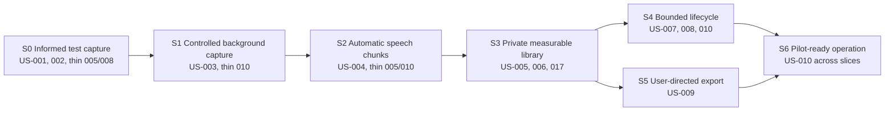
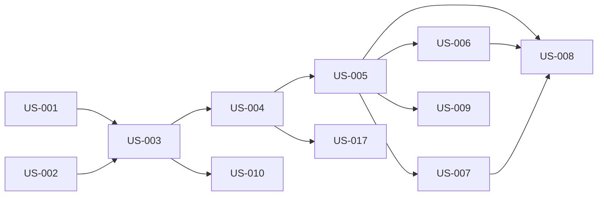

# Story hierarchy and delivery map

## Product hierarchy

```mermaid
flowchart TB
    O[Product outcome: preserve relevant spoken interactions privately]
    O --> D1[D1 Activation and control]
    O --> D2[D2 Capture and detection]
    O --> D3[D3 Recording library]
    O --> D4[D4 Privacy and lifecycle]
    O --> D5[D5 Operations and trust]
    O -. post-MVP .-> D6[D6 Enrichment]

    D1 --> E1[E1 Start safely]
    E1 --> U1[US-001 Onboarding]
    E1 --> U2[US-002 Select and test microphone]
    E1 --> U3[US-003 Control background capture]

    D2 --> E2[E2 Preserve likely speech]
    E2 --> U4[US-004 Detect and chunk speech]

    D3 --> E3[E3 Understand captured material]
    E3 --> U5[US-005 Review library]
    E3 --> U17[US-017 Sort by signal measurements]

    D4 --> E4[E4 Control sensitive data]
    E4 --> U6[US-006 Protect locally]
    E4 --> U7[US-007 Retention and capacity]
    E4 --> U8[US-008 Protected-safe deletion]
    E4 --> U9[US-009 Explicit export]

    D5 --> E5[E5 Know whether it works]
    E5 --> U10[US-010 Monitoring and diagnostics]

    D6 --> E6[E6 Optional improvements]
    E6 --> U11[US-011 Local transcription]
    E6 --> U12[US-012 Difficult-speech improvements]
    E6 --> U13[US-013 Mobile import]
    E6 --> U14[US-014 Assisted review]
    E6 --> U15[US-015 Start at sign-in]
    E6 --> U16[US-016 Edit retention in UI]
```

## Vertical-slice dependencies

```mermaid
flowchart LR
    S0[S0 Informed test capture<br/>US-001, 002, thin 005/008]
    S1[S1 Controlled background capture<br/>US-003, thin 010]
    S2[S2 Automatic speech chunks<br/>US-004, thin 005/010]
    S3[S3 Private measurable library<br/>US-005, 006, 017]
    S4[S4 Bounded lifecycle<br/>US-007, 008, 010]
    S5[S5 User-directed export<br/>US-009]
    S6[S6 Pilot-ready operation<br/>US-010 across slices]

    S0 --> S1 --> S2 --> S3
    S3 --> S4
    S3 --> S5
    S4 --> S6
    S5 --> S6
```

## User-story dependencies

```mermaid
flowchart LR
    U1[US-001] --> U3[US-003]
    U2[US-002] --> U3
    U3 --> U4[US-004]
    U3 --> U10[US-010]
    U4 --> U5[US-005]
    U4 --> U17[US-017]
    U5 --> U6[US-006]
    U5 --> U7[US-007]
    U5 --> U8[US-008]
    U5 --> U9[US-009]
    U6 --> U8
    U7 --> U8
```
