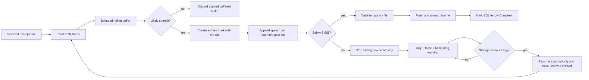
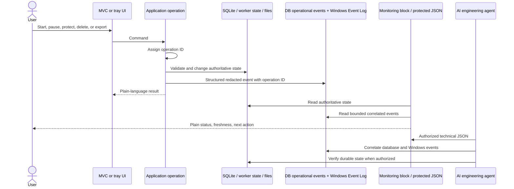
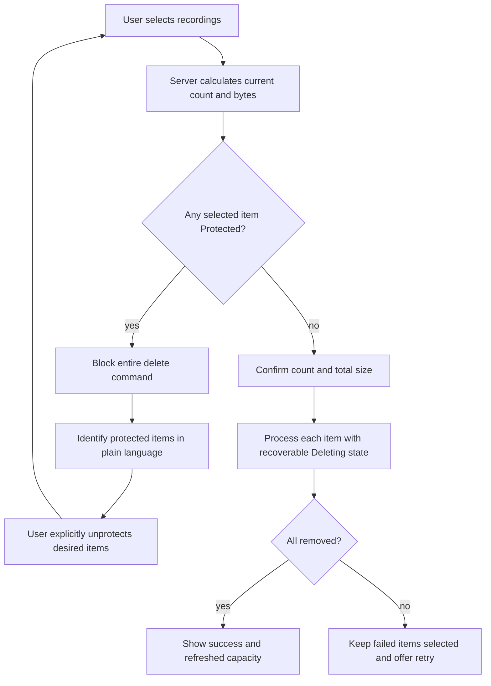
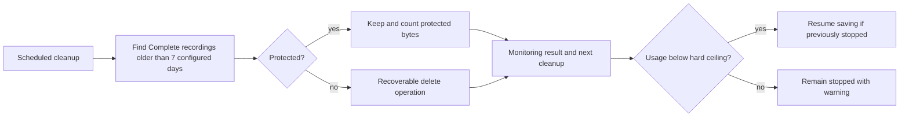

# Technical and operational flows

## Capture and automatic recovery

```mermaid
flowchart LR
    MIC[Selected microphone] --> FRAME[Read PCM frame]
    FRAME --> BUFFER[Bounded rolling buffer]
    BUFFER --> DETECT{Likely speech?}
    DETECT -- no --> DISCARD[Discard expired buffered audio]
    DETECT -- yes --> CHUNK[Create active chunk with pre-roll]
    CHUNK --> CONTINUE[Append speech and bounded post-roll]
    CONTINUE --> CAPACITY{Below 5 GiB?}
    CAPACITY -- yes --> TEMP[Write temporary file]
    TEMP --> FINAL[Flush and atomic rename]
    FINAL --> DB[Mark SQLite row Complete]
    CAPACITY -- no --> STOP[Stop saving new recordings]
    STOP --> WARN[Tray + toast + Monitoring warning]
    WARN --> RECHECK{Storage below ceiling?}
    RECHECK -- no --> WARN
    RECHECK -- yes --> RESUME[Resume automatically and close unsaved interval]
    RESUME --> FRAME
```

## Feature command, monitoring, and AI-maintenance correlation

```mermaid
sequenceDiagram
    actor User
    participant UI as MVC or tray UI
    participant App as Application operation
    participant State as SQLite / worker state / files
    participant Log as DB operational events + Windows Event Log
    participant Monitor as Monitoring block / protected JSON
    participant Bot as AI engineering agent

    User->>UI: Start, pause, protect, delete, or export
    UI->>App: Command
    App->>App: Assign operation ID
    App->>State: Validate and change authoritative state
    App->>Log: Structured redacted event with operation ID
    App-->>UI: Plain-language result
    Monitor->>State: Read authoritative state
    Monitor->>Log: Read bounded correlated events
    Monitor-->>User: Plain status, freshness, next action
    Bot->>Monitor: Authorized technical JSON
    Bot->>Log: Correlate database and Windows events
    Bot->>State: Verify durable state when authorized
```

## Protected-safe bulk deletion

```mermaid
flowchart TD
    SELECT[User selects recordings] --> SUMMARY[Server calculates current count and bytes]
    SUMMARY --> CHECK{Any selected item Protected?}
    CHECK -- yes --> BLOCK[Block entire delete command]
    BLOCK --> IDENTIFY[Identify protected items in plain language]
    IDENTIFY --> UNPROTECT[User explicitly unprotects desired items]
    UNPROTECT --> SELECT
    CHECK -- no --> CONFIRM[Confirm count and total size]
    CONFIRM --> DELETE[Process each item with recoverable Deleting state]
    DELETE --> RESULT{All removed?}
    RESULT -- yes --> DONE[Show success and refreshed capacity]
    RESULT -- no --> RETRY[Keep failed items selected and offer retry]
```

## Seven-day retention

```mermaid
flowchart LR
    TIMER[Scheduled cleanup] --> QUERY[Find Complete recordings older than 7 configured days]
    QUERY --> PROTECTED{Protected?}
    PROTECTED -- yes --> KEEP[Keep and count protected bytes]
    PROTECTED -- no --> REMOVE[Recoverable delete operation]
    KEEP --> REPORT[Monitoring result and next cleanup]
    REMOVE --> REPORT
    REPORT --> SPACE{Usage below hard ceiling?}
    SPACE -- yes --> RESUME[Resume saving if previously stopped]
    SPACE -- no --> WARN[Remain stopped with warning]
```
